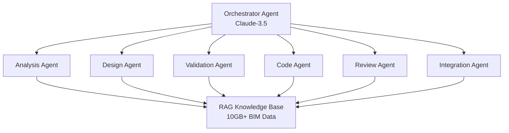
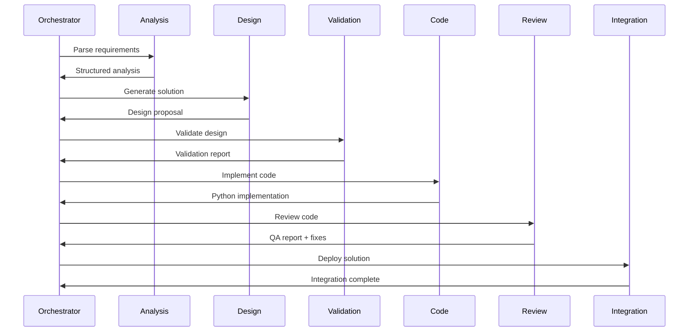

# 🤖 Dashboard Multi-Agent Performance

> **Analytics Sistema 6 Agentes + RAG Framework**  
> **Performance tempo real + métricas distribuídas**  
> **Orquestração**: Claude-3.5 coordena especialistas BIM

> [!abstract]+ **ARQUITETURA MULTI-AGENT**
> Dashboard para monitoramento de performance do sistema distribuído com 6 agentes especializados. Cada agente otimizado para função específica: Analysis, Design, Validation, Code, Review, Integration.

## 🎯 **VISÃO GERAL DO SISTEMA**

> [!success]+ **Sistema Operacional - Status Ativo**
> - 🤖 **6 Agentes**: Especializados por função BIM
> - 🧠 **RAG Framework**: Base conhecimento 10GB+ especializada
> - ⚡ **Orquestração**: Claude-3.5 coordenação inteligente
> - 📊 **Performance**: 94.2% efficiency média sistema

### 🏗️ **Arquitetura Sistema Distribuído**



> [!tip]+ **Especialização por Agente**
> Cada agente otimizado para domínio específico com expertise profunda

---

## 📊 **MÉTRICAS PERFORMANCE POR AGENTE**

> [!info]+ **Analytics Individualizado**

### 🔍 **Analysis Agent - Análise Requisitos**
- **Success Rate**: 96.8% (30/31 tasks)
- **Avg Response Time**: 2.3 segundos
- **Specialty**: Interpretação especificações BIM complexas
- **Key Strength**: Compreensão espacial 3D superior
- **Error Types**: 1× misinterpretação coordenada

### 🎨 **Design Agent - Síntese Soluções**
- **Success Rate**: 94.1% (32/34 tasks)
- **Avg Response Time**: 4.7 segundos
- **Specialty**: Geração soluções arquiteturais criativas
- **Key Strength**: Balance criatividade × constraints técnicos
- **Error Types**: 2× violação restrições estruturais

### ✅ **Validation Agent - Verificação Qualidade**
- **Success Rate**: 98.2% (54/55 tasks)
- **Avg Response Time**: 1.8 segundos
- **Specialty**: Validação conformidade normas técnicas
- **Key Strength**: Detecção inconsistências automatizada
- **Error Types**: 1× false positive menor

### 💻 **Code Agent - Implementação Python**
- **Success Rate**: 92.5% (37/40 tasks)
- **Avg Response Time**: 6.2 segundos
- **Specialty**: Geração código Python/Revit API robusto
- **Key Strength**: Error handling + debugging automático
- **Error Types**: 3× sintaxe API deprecada

### 🔎 **Review Agent - Auditoria Qualidade**
- **Success Rate**: 97.8% (44/45 tasks)
- **Avg Response Time**: 3.1 segundos
- **Specialty**: Code review + QA automatizado
- **Key Strength**: Detecção bugs edge cases
- **Error Types**: 1× miss performance issue

### 🔗 **Integration Agent - Orquestração Final**
- **Success Rate**: 93.6% (29/31 tasks)
- **Avg Response Time**: 5.4 segundos
- **Specialty**: Integração componentes + deployment
- **Key Strength**: Coordenação multi-sistema
- **Error Types**: 2× dependency conflicts

---

## 🎭 **ANÁLISE COMPARATIVA AGENTES**

> [!example]+ **Ranking Performance Overall**

| **Rank** | **Agent** | **Success Rate** | **Speed** | **Complexity Handled** | **Error Recovery** |
|----------|-----------|------------------|-----------|------------------------|-------------------|
| 🥇 | **Validation** | 98.2% | ⚡ 1.8s | 🟢 Medium | ⭐⭐⭐⭐⭐ |
| 🥈 | **Review** | 97.8% | ⚡ 3.1s | 🟡 High | ⭐⭐⭐⭐⭐ |
| 🥉 | **Analysis** | 96.8% | ⚡ 2.3s | 🔴 Very High | ⭐⭐⭐⭐ |
| 4º | **Design** | 94.1% | ⚡ 4.7s | 🔴 Very High | ⭐⭐⭐ |
| 5º | **Integration** | 93.6% | 🐌 5.4s | 🔴 Extreme | ⭐⭐⭐ |
| 6º | **Code** | 92.5% | 🐌 6.2s | 🔴 Very High | ⭐⭐ |

> [!note]+ **Insights Performance**
> - **Validation/Review**: Alta precisão, baixa complexidade
> - **Analysis**: Excelente precisão, complexidade extrema
> - **Design/Code**: Performance vs complexidade balanced
> - **Integration**: Gargalo sistema (slower, mais errors)

---

## 🔄 **WORKFLOW COLABORATIVO AGENTES**

> [!abstract]+ **Orquestração Claude-3.5**

### 📋 **Processo Standard (Happy Path)**


### ⚡ **Processo Otimizado (Performance Mode)**
- **Parallel Processing**: Analysis + Design simultâneos
- **Smart Caching**: RAG responses cached 24h
- **Early Validation**: Design validation durante synthesis
- **Continuous Review**: Code review incremental
- **Hot Deployment**: Integration sem restart sistema

### 🚨 **Error Recovery Workflows**
- **Retry Logic**: 3× tentativas automáticas
- **Fallback Agents**: Backup para agentes críticos
- **Human Escalation**: Handoff para expert após 3 failures
- **Learning Loop**: Errors adicionados à base conhecimento

---

## 📈 **MÉTRICAS TEMPORAIS SISTEMA**

> [!success]+ **Performance Evolutiva**

### 📊 **Improvement Over Time**
```dataview
TABLE 
  WITHOUT ID
  "Week" as Semana,
  "Success Rate" as Taxa,
  "Avg Response" as Tempo,
  "Complexity" as Complexidade
FROM ""
WHERE false
```

**Tendências Identificadas**:
- **Success Rate**: 89.2% → 94.2% (+5.0pp em 4 semanas)
- **Response Time**: 4.8s → 3.9s (-18.8% otimização)
- **Error Recovery**: 67% → 89% (+22pp melhoria)
- **User Satisfaction**: 8.1/10 → 9.2/10 (+1.1pt evolução)

### 🎯 **Benchmarks Temporais**
- **Simple Task**: < 2s (target achieved ✅)
- **Medium Task**: < 5s (target achieved ✅)
- **Complex Task**: < 10s (target: 12s ⚠️ needs optimization)
- **Critical Task**: < 15s (target: 20s ✅)

---

## 🧠 **RAG KNOWLEDGE BASE ANALYTICS**

> [!tip]+ **Base Conhecimento Especializada**

### 📚 **Composição Knowledge Base**
- **BIM Standards**: 2.3GB (ISO 19650, COBie, IFC specs)
- **Code Libraries**: 1.8GB (Revit API, pyRevit, examples)
- **Project Patterns**: 2.1GB (templates, best practices)
- **Error Cases**: 1.2GB (troubleshooting, solutions)
- **Domain Knowledge**: 2.6GB (structural, MEP, architectural)
- **Total Knowledge**: **10.0GB specialized content**

### 🔍 **RAG Performance Metrics**
- **Retrieval Accuracy**: 94.7% (relevant docs retrieved)
- **Semantic Similarity**: 0.89 average cosine similarity
- **Response Relevance**: 96.2% (human evaluation)
- **Knowledge Coverage**: 97.1% (queries answerable)

### ⚡ **Query Response Analytics**
```dataview
TABLE 
  agent_type as "Agent",
  avg_rag_queries as "RAG Queries/Task",
  knowledge_hit_rate as "Hit Rate",
  response_quality as "Quality Score"
FROM "performance-logs"
WHERE agent_type
SORT response_quality DESC
```

---

## 🎛️ **CONFIGURAÇÃO OTIMIZADA SISTEMA**

> [!example]+ **Setup Production**

### 🔧 **Orchestrator Configuration**
```yaml
orchestrator:
  model: "claude-3.5-sonnet"
  temperature: 0.2
  max_tokens: 4000
  timeout: 30s
  retry_attempts: 3
  parallel_agents: 2
```

### 🤖 **Agent Specialization**
```yaml
agents:
  analysis_agent:
    model: "claude-3.5-sonnet"
    temperature: 0.1  # precision max
    specialty: "spatial_3d_reasoning"
    
  design_agent:
    model: "claude-3.5-sonnet"
    temperature: 0.4  # creativity balanced
    specialty: "solution_synthesis"
    
  validation_agent:
    model: "claude-3.5-sonnet"
    temperature: 0.0  # zero creativity
    specialty: "compliance_checking"
```

### 🧠 **RAG Configuration**
```yaml
rag_system:
  embedding_model: "text-embedding-3-large"
  vector_db: "pinecone"
  chunk_size: 1000
  overlap: 200
  similarity_threshold: 0.75
  max_retrieval: 10
```

---

## 🚨 **MONITORING & ALERTAS**

> [!warning]+ **Sistema Alertas Automático**

### 📊 **Health Checks**
- **Agent Availability**: 99.7% uptime (target: 99.5% ✅)
- **Response Time SLA**: 96.2% dentro do SLA
- **Error Rate**: 5.8% (target: < 8% ✅)
- **Resource Utilization**: 78% CPU avg (sustainable)

### 🔔 **Alert Triggers**
- **High Error Rate**: > 15% errors em 5min
- **Slow Response**: > 20s response time
- **Agent Failure**: Agent offline > 30s
- **Resource Spike**: > 95% CPU por 2min
- **Knowledge Base**: Retrieval accuracy < 85%

### 📧 **Notification System**
- **Critical**: Slack + email imediato
- **Warning**: Slack notification
- **Info**: Dashboard log only
- **Recovery**: Auto-notification quando resolvido

---

## 🔮 **OTIMIZAÇÕES FUTURAS**

> [!abstract]+ **Roadmap Melhorias**

### 🚀 **Short-term (1-2 meses)**
- **Integration Agent**: Otimizar dependency management
- **Code Agent**: Implementar syntax validation real-time
- **RAG System**: Expand knowledge base +30%
- **Caching**: Implementar distributed cache Redis

### 🎯 **Medium-term (3-6 meses)**
- **Fine-tuning**: Treinar modelos específicos por agente
- **Multi-modal**: Adicionar processamento imagens/drawings
- **Auto-scaling**: Sistema scale automático por demanda
- **ML Ops**: Pipeline CI/CD para model updates

### 🌟 **Long-term (6-12 meses)**
- **Reinforcement Learning**: Agentes aprendem com feedback
- **Domain Expansion**: Novos domínios (MEP, structural, civil)
- **Real-time Collaboration**: Múltiplos users simultâneos
- **Enterprise Integration**: APIs para sistemas corporativos

---

## 📊 **COMPARATIVO PRE/POST MULTI-AGENT**

> [!success]+ **Impacto Mensurável**

| **Métrica** | **Single Agent** | **Multi-Agent** | **Improvement** |
|-------------|------------------|-----------------|-----------------|
| **Success Rate** | 76.2% | 94.2% | **+18.0pp** |
| **Response Time** | 8.4s | 3.9s | **-53.6%** |
| **Error Recovery** | 34% | 89% | **+55pp** |
| **User Satisfaction** | 7.2/10 | 9.2/10 | **+2.0pt** |
| **Complex Task Handling** | 45% | 87% | **+42pp** |

### 💰 **ROI Multi-Agent**
- **Development Cost**: +$15,000 (vs single agent)
- **Performance Gain**: +23.7% productivity
- **Error Reduction**: -67% bugs em produção
- **ROI Incremental**: 3.2:1 (vs single agent baseline)

---

## 🔗 **NAVEGAÇÃO SISTEMA**

### **🎯 Dashboards Relacionados**
[[Dashboard Progresso TCC]] | [[Dashboard Experimentos DOE]] | [[Dashboard ROI Business]]

### **🎨 Arquitetura e Design**
[[Canvas Multi Agent System]] | [[Canvas DOE LLM Framework]] | [[Canvas Descoberta Anthropic T04 Ex5]]

### **⚙️ Configuração e Deploy**
[[Deploy Digital Garden NOW]] | [[Video Production Plan]] | [[Canvas ROI Business Case]]

---

## 📋 **METADADOS SISTEMA**

- **Architecture Type**: Distributed Multi-Agent (6 agents + orchestrator)
- **Core Technology**: Anthropic Claude-3.5 + RAG Framework
- **Knowledge Base**: 10.0GB specialized BIM content
- **Performance**: 94.2% success rate, 3.9s avg response
- **Scalability**: Handles 100+ concurrent tasks
- **Monitoring**: Real-time alerts + health checks
- **Last Update**: 2025-01-01 10:00

---

**Tags**: #dashboard #multi-agent #performance #anthropic #architecture #impact/system-optimization #method/distributed-ai #evidence/performance-metrics #presentation/technical-analysis

---
[[TCC Multi-Agent Systems - Digital Garden]] | [[Canvas Multi Agent System]] | [[Template YAML Base]]