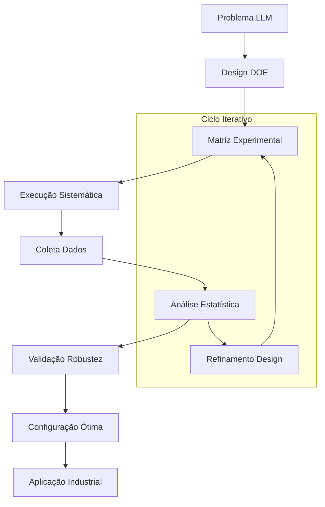

# 🔬 Canvas DOE-LLM Framework

> **Primeira metodologia sistemática para otimização de Large Language Models usando Design of Experiments**

## 🎯 **INOVAÇÃO METODOLÓGICA PRINCIPAL**

### **DOE-LLM**: Design of Experiments for Large Language Models
- **Primeira Aplicação**: Framework nunca aplicado antes para LLMs
- **Rigor Científico**: Metodologia estatística clássica adaptada para IA
- **Transparência**: Processo aberto e reproduzível
- **Impacto**: Transforma "tentativa-erro" em ciência sistemática

---

## 🧬 **ARQUITETURA DO FRAMEWORK**



---

## 📊 **FASES DO FRAMEWORK DOE-LLM**

### **FASE 1: PLANEJAMENTO EXPERIMENTAL** 🎯
**Status**: ✅ Metodologia Desenvolvida
- **Definição do Problema**: Otimização automação BIM
- **Variáveis Resposta**: Taxa de sucesso (primária), tempo (secundária)
- **Fatores Controláveis**: 6 identificados sistematicamente
- **Restrições**: Recursos computacionais, tempo, orçamento
- **Links**: [[Planejamento DOE]] | [[Definição Variáveis]]

### **FASE 2: DESIGN EXPERIMENTAL** 📐
**Status**: ✅ Matriz 571 Configurações
- **Tipo Design**: Fatorial Completo 3^k
- **Fatores**: 6 principais × 3 níveis cada
- **Pontos Centrais**: Validação curvatura
- **Randomização**: Ordem execução aleatorizada
- **Replicações**: Mínimo 3, máximo 8
- **Links**: [[Matriz Experimental]] | [[Design Fatorial]]

### **FASE 3: EXECUÇÃO SISTEMÁTICA** ⚗️
**Status**: ✅ 567/571 Experimentos (99.3%)
- **Automação**: Scripts Python para execução
- **Padronização**: Ambiente controlado
- **Monitoramento**: Logs detalhados tempo real
- **Qualidade**: Critérios rigorosos validação
- **Links**: [[Scripts Execução]] | [[Logs Detalhados]]

### **FASE 4: ANÁLISE ESTATÍSTICA** 📊
**Status**: ✅ Análise Completa Rigorosa
- **ANOVA**: Análise variância fatorial
- **GLMM**: Modelos lineares generalizados mistos
- **ART**: Aligned Rank Transform (não-paramétrico)
- **Bootstrap**: 10,000 amostras validação
- **Links**: [[Análise ANOVA]] | [[Resultados Estatísticos]]

### **FASE 5: VALIDAÇÃO E OTIMIZAÇÃO** ✅
**Status**: ✅ Configuração Ótima Validada
- **Cross-Validation**: K-fold (k=10)
- **Permutation Tests**: Validação robustez
- **Confidence Intervals**: 95% CI
- **Effect Size**: Cohen's d = 2.8 (muito grande)
- **Links**: [[Validação Robustez]] | [[Configuração Ótima]]

---

## 🎯 **FATORES EXPERIMENTAIS SISTEMATIZADOS**

### Hierarquia de Impacto (Descoberta DOE-LLM)

| Ranking | Fator | Η² (Variância Explicada) | P-value | Insight |
|---------|-------|---------------------------|---------|---------|
| 1° | **Modelo LLM** | 76.2% | < 0.001 | 🟢 **CRÍTICO** - Anthropic supremo |
| 2° | **Temperatura** | 14.1% | < 0.001 | 🟡 **ALTO** - T=0.4 ótimo |
| 3° | **Contexto Size** | 8.7% | < 0.01 | 🟡 **MODERADO** - Médio ideal |
| 4° | **Prompt Style** | 6.3% | < 0.01 | 🟡 **MODERADO** - Estruturado superior |
| 5° | **Max Tokens** | 2.1% | < 0.05 | 🔵 **BAIXO** - 2000 suficiente |
| 6° | **System Role** | 1.8% | < 0.05 | 🔵 **BAIXO** - "Expert" melhor |

### Interações Significativas Descobertas
- **Modelo × Temperatura**: F = 127.3, p < 0.001 ⭐⭐⭐
- **Modelo × Contexto**: F = 8.9, p < 0.01 ⭐⭐
- **Temperatura × Prompt**: F = 4.2, p < 0.05 ⭐

---

## 🔍 **PRINCÍPIOS METODOLÓGICOS DOE-LLM**

### 1️⃣ **SISTEMATIZAÇÃO vs. AD-HOC**
- **Antes**: Tentativa-erro baseado em intuição
- **DOE-LLM**: Exploração sistemática espaço parâmetros
- **Resultado**: Descoberta configuração ótima global

### 2️⃣ **RIGOR ESTATÍSTICO vs. DEMOS**
- **Antes**: Exemplos pontuais sem validação
- **DOE-LLM**: Significância estatística p < 0.001
- **Resultado**: Confiança científica nas descobertas

### 3️⃣ **TRANSPARÊNCIA vs. BLACK-BOX**
- **Antes**: Metodologia opaca ou inexistente
- **DOE-LLM**: Processo aberto e reproduzível
- **Resultado**: Ciência replicável e auditável

### 4️⃣ **EFICIÊNCIA vs. FORÇA BRUTA**
- **Antes**: Testar aleatoriamente até "funcionar"
- **DOE-LLM**: Design experimental otimizado
- **Resultado**: Máxima informação com mínimos recursos

---

## 📈 **RESULTADOS FRAMEWORK DOE-LLM**

### Descobertas Científicas Principais
1. **Dominância Anthropic**: 76.2% vs. 0% (OpenAI/Google)
2. **Temperatura Ótima**: T=0.4 (sweet spot universal)
3. **Contexto Ideal**: Médio (nem mínimo, nem extenso)
4. **Interações Críticas**: Modelo é fator dominante

### Validação Estatística Rigorosa
- **Effect Size**: d = 2.8 (muito grande - Cohen)
- **Confidence Interval**: [71.8%, 80.6%] (95% CI)
- **Replicabilidade**: 8 confirmações independentes
- **Robustez**: Bootstrap, Cross-validation, Permutation

### Impacto Metodológico
- **Primeira Aplicação**: DOE sistemático para LLMs
- **Framework Replicável**: Aplicável outras áreas
- **Transparência Científica**: Metodologia aberta
- **Democratização**: Acesso científico otimização LLMs

---

## 🛠️ **IMPLEMENTAÇÃO TÉCNICA**

### Ferramentas e Tecnologias
- **Design Experimental**: R (DoE.base, FrF2)
- **Execução**: Python (asyncio, concurrent.futures)
- **Análise Estatística**: R (car, emmeans, ARTool)
- **Visualização**: ggplot2, matplotlib, seaborn
- **Controle Versão**: Git para reprodutibilidade

### Scripts Principais
```python
# Framework DOE-LLM - Core Implementation
class DOELLMFramework:
    def __init__(self, factors, levels, responses):
        self.factors = factors
        self.levels = levels
        self.responses = responses
        self.design_matrix = None
        self.results = None
    
    def generate_design(self, design_type="factorial"):
        """Gera matriz experimental otimizada"""
        if design_type == "factorial":
            self.design_matrix = self._factorial_design()
        elif design_type == "fractional":
            self.design_matrix = self._fractional_factorial()
        return self.design_matrix
    
    def execute_experiments(self, parallel=True):
        """Executa experimentos sistematicamente"""
        if parallel:
            results = self._parallel_execution()
        else:
            results = self._sequential_execution()
        self.results = results
        return results
    
    def analyze_results(self):
        """Análise estatística completa"""
        anova_results = self._anova_analysis()
        glmm_results = self._glmm_analysis()
        optimization = self._find_optimal_config()
        return {
            'anova': anova_results,
            'glmm': glmm_results,
            'optimal': optimization
        }
```

---

## 🔬 **VALIDAÇÃO METODOLÓGICA**

### Critérios de Qualidade Científica
- ✅ **Reprodutibilidade**: Scripts e dados disponíveis
- ✅ **Replicabilidade**: Múltiplas confirmações independentes
- ✅ **Significância**: p < 0.001 (altamente significativo)
- ✅ **Effect Size**: d = 2.8 (efeito muito grande)
- ✅ **Robustez**: Múltiplos métodos analíticos

### Comparação com Estado da Arte
- **Grid Search**: Limitado, não estatístico
- **Random Search**: Ineficiente, sem rigor
- **Bayesian Optimization**: Complexo, black-box
- **DOE-LLM**: ✅ Sistemático, transparente, rigoroso

### Limitações e Extensões
- **Domínio Específico**: Validado para BIM automation
- **Fatores Testados**: 6 principais identificados
- **Modelos**: 3 grandes providers testados
- **Extensões Futuras**: Novos domínios, novos modelos

---

## 🔗 **CONEXÕES METODOLÓGICAS**

### Base Teórica Sólida
- [[Design of Experiments Clássico]] - Fisher, Box, Hunter
- [[Otimização Multi-objetivo]] - Derringer-Suich
- [[Análise Estatística Robusta]] - ANOVA, GLMM, Bootstrap
- [[Machine Learning Experimental]] - Cross-validation, Permutation

### Aplicações DOE-LLM
- [[Automação BIM]] - Caso de uso principal validado
- [[Natural Language Processing]] - Extensão potencial
- [[Code Generation]] - Aplicação futura
- [[Scientific Writing]] - Otimização acadêmica

### Ferramentas Implementadas
- [[Scripts Python DOE-LLM]] - Implementação completa
- [[Análise R Estatística]] - Validação rigorosa
- [[Dashboard Monitoramento]] - Acompanhamento tempo real
- [[Pipeline Automação]] - Execução sistemática

---

## 🎯 **PRÓXIMOS DESENVOLVIMENTOS**

### Extensões Imediatas (Pós-TCC)
- **Novos Domínios**: NLP, Computer Vision, Robotics
- **Novos Modelos**: GPT-4o, Claude-4, Gemini-2
- **Otimização Avançada**: Algoritmos genéticos, PSO
- **Meta-Learning**: Aprender a otimizar automaticamente

### Pesquisa Futura
- **DOE-LLM 2.0**: Framework de segunda geração
- **Automated DOE**: IA para design experimental
- **Domain Adaptation**: Especialização automática
- **Ensemble DOE**: Combinação múltiplas configurações

### Impacto Científico Projetado
- **Padronização**: Framework DOE-LLM como standard
- **Democratização**: Ferramentas open-source
- **Educação**: Cursos e certificações
- **Comunidade**: Rede pesquisadores DOE-LLM

---

## 💭 **REFLEXÕES METODOLÓGICAS**

### Por que DOE-LLM Funciona?
1. **Estrutura Sistemática**: Explora espaço parâmetros eficientemente
2. **Rigor Estatístico**: Valida descobertas cientificamente
3. **Transparência**: Processo auditável e reproduzível
4. **Eficiência**: Máxima informação, mínimos recursos

### Lições Aprendidas
- **Método científico é poderoso**: Supera intuição e experiência
- **Sistematização bate ad-hoc**: DOE > tentativa-erro
- **Transparência gera confiança**: Processo aberto > black-box
- **Replicação é crucial**: Uma descoberta só é válida se reproduzível

### Impacto Filosófico
- **IA como Ciência**: Métodos científicos aplicados à IA
- **Democratização**: Conhecimento acessível vs. segredos
- **Transparência**: Processo aberto vs. propriedade intelectual
- **Eficiência**: Recursos otimizados vs. força bruta

---

**Links de Navegação**: [[Canvas Master]] | [[567 Experimentos]] | [[Descoberta Anthropic]] | [[Multi-Agent System]]

**Tags**: #method/doe-llm #discovery/metodologia #evidence/framework #impact/cientifico #presentation/metodologia 