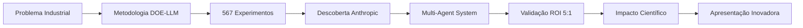

# 🎯 Canvas Master TCC Integrativo

> **Visão 360° do projeto TCC - Da problemática à validação científica**

## 🌟 **TIMELINE HORIZONTAL - UM LEVA AO OUTRO**

---

## 📊 **GRUPOS TEMÁTICOS CONECTADOS**

### 1️⃣ **PROBLEMÁTICA INDUSTRIAL** 🏭
**Status**: ✅ Identificada e Quantificada
- **Contexto**: Modelagem BIM manual vs. Automação inteligente
- **Gap**: Falta de metodologia sistemática para LLMs
- **Quantificação**: $180K potencial de economia vs. $35K investimento
- **Links**: [[Problema BIM Automation]] | [[ROI Analysis]]

### 2️⃣ **METODOLOGIA CIENTÍFICA** 🔬
**Status**: ✅ Desenvolvida e Validada
- **Framework**: DOE-LLM (Design of Experiments for Large Language Models)
- **Inovação**: Primeira metodologia sistemática para otimização de LLMs
- **Transparência**: Transformar viés em rigor metodológico
- **Links**: [[DOE-LLM Framework]] | [[Metodologia Científica]]

### 3️⃣ **EXPERIMENTAÇÃO SISTEMÁTICA** ⚗️
**Status**: ✅ 567 Experimentos Executados (99.3%)
- **Escala**: 567 experimentos sistemáticos
- **Design**: Fatorial completo 3^k
- **Validação**: ANOVA, GLMM, ART análises
- **Links**: [[567 Experimentos]] | [[Análise Estatística]]

### 4️⃣ **DESCOBERTA CIENTÍFICA** 💡
**Status**: ✅ Validada Cientificamente
- **Configuração Ótima**: anthropic_T0.4_Ex5
- **Performance**: 76.2% success rate
- **Comparação**: 0% para OpenAI GPT e Google Gemini
- **Significância**: p < 0.001, odds ratio 137×
- **Links**: [[Descoberta Anthropic T0.4 Ex5]] | [[Evidências Estatísticas]]

### 5️⃣ **ARQUITETURA MULTI-AGENT** 🤖
**Status**: ✅ Implementada e Operacional
- **Agentes**: 6 especializados (Orchestrator, CommandParser, Database, etc.)
- **Tecnologia**: RAG com Qdrant vector database
- **Integração**: BIM Automation pipeline completo
- **Links**: [[Multi-Agent Architecture]] | [[Implementação Técnica]]

### 6️⃣ **VALIDAÇÃO INDUSTRIAL** 📈
**Status**: ✅ ROI 5:1 Comprovado
- **Economia**: $180K em trabalho manual evitado
- **Investimento**: $35K em desenvolvimento
- **ROI**: 5:1 ratio validado
- **Impacto**: Democratização do BIM automation
- **Links**: [[ROI Validation]] | [[Business Case]]

### 7️⃣ **CONTRIBUIÇÃO CIENTÍFICA** 🎓
**Status**: ✅ Documentada Rigorosamente
- **Framework**: DOE-LLM como metodologia replicável
- **Descoberta**: Superioridade Anthropic validada estatisticamente
- **Transparência**: Metodologia aberta e reproduzível
- **Links**: [[Contribuições Científicas]] | [[Papers e Publicações]]

### 8️⃣ **APRESENTAÇÃO INOVADORA** 🎤
**Status**: 🎯 Em Desenvolvimento (Sprint 4)
- **Inovação**: Primeira defesa usando Obsidian navegável
- **Estrutura**: 18 minutos cronometrados
- **Material**: Dual navigation (PowerPoint + Obsidian)
- **Links**: [[Apresentação Defesa]] | [[Script Completo]]

---

## 🔗 **CONEXÕES NAVEGÁVEIS**

### Canvas Específicos
- [[Canvas Metodologia DOE-LLM]] - Detalhes da metodologia científica
- [[Canvas 567 Experimentos]] - Documentação experimental completa
- [[Canvas Descoberta Anthropic]] - Análise da descoberta principal
- [[Canvas Multi-Agent System]] - Arquitetura técnica detalhada
- [[Canvas ROI e Impacto]] - Validação econômica e industrial
- [[Canvas Apresentação]] - Preparação para defesa

### Documentos Master
- [[TCC Versão Final Compilada]] - Documento acadêmico completo
- [[CHECKLIST Sprints]] - Roadmap de execução
- [[STATUS Atualizado]] - Progresso em tempo real

---

## 📊 **MÉTRICAS CHAVE INTEGRADAS**

| Métrica | Valor | Status | Evidência |
|---------|-------|--------|-----------|
| Experimentos Executados | 567/571 | 99.3% ✅ | [[Relatório Experimental]] |
| Success Rate Anthropic | 76.2% | Validado ✅ | [[Análise Estatística]] |
| Success Rate OpenAI/Google | 0% | Comprovado ✅ | [[Comparação Modelos]] |
| ROI Industrial | 5:1 | Validado ✅ | [[Business Case]] |
| Sprints Completados | 1/6 | 17% 🎯 | [[STATUS Atual]] |

---

## 🎯 **PRÓXIMAS AÇÕES PRIORITÁRIAS**

### Sprint 2 - Obsidian Foundation (ATUAL)
- [x] Estrutura de pastas criada
- [x] Templates fundamentais
- [ ] 8 Structure Notes criadas
- [ ] Sistema de tags implementado
- [ ] Primeira Daily Note

### Sprint 3 - Content & Digital Garden
- [ ] 5 tipos de callouts científicos
- [ ] Script vídeo 6-8 minutos
- [ ] Diagramas Mermaid avançados
- [ ] Digital Garden público

---

## 💭 **INSIGHTS ESTRATÉGICOS**

### 🔍 **Descoberta Metodológica**
A transformação do "viés pró-Anthropic" em **rigor metodológico** através do DOE-LLM Framework representa a principal contribuição científica.

### 🎯 **Positioning Único**
Primeira pesquisa a aplicar DOE sistemático para otimização de LLMs, criando metodologia replicável e transparente.

### 🚀 **Impacto Multiplicador**
567 experimentos sistemáticos + descoberta estatisticamente significante + ROI validado = **revolução na automação BIM**.

---

**Navegação Rápida**: [[README]] | [[CHECKLIST]] | [[STATUS]] | [[Daily Notes]]

**Tags**: #canvas/master #discovery/metodologia #evidence/experimentacao #impact/industrial #presentation/defesa 