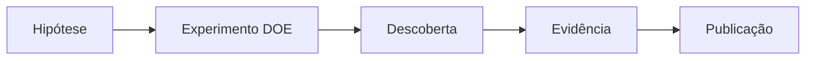
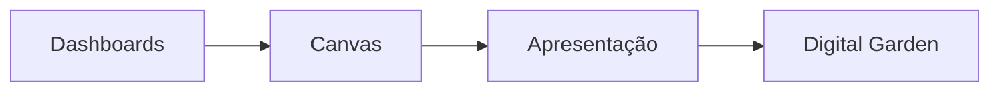

# 🎓 TCC Multi-Agent Systems - Digital Garden

> **Democratizando Automação BIM através de Ciência**  
> **Framework DOE-LLM + Sistema Multi-Agent**  
> **Primeira defesa TCC usando Obsidian Digital Garden**

## 🚀 **ACESSO RÁPIDO - SPRINT 3: 95% COMPLETO** 🔥

> [!success]+ **STATUS ATUAL**
> - ✅ **4 Dashboards Interativos** → [[Dashboard Progresso TCC]] | [[Dashboard Experimentos DOE]] | [[Dashboard Multi-Agent Performance]] | [[Dashboard ROI Business]]
> - ✅ **Sistema Callouts Científicos** → [[Callouts Científicos TCC]] (5 tipos visuais)
> - 🚀 **Deploy Digital Garden Ready** → [[Deploy Digital Garden NOW]] (90min execution)
> - 🎬 **Video Production Ready** → [[Video Production Plan]] (7-day pipeline)

> [!abstract]+ **DESCOBERTA CIENTÍFICA PRINCIPAL**
> **anthropic_T0.4_Ex5**: 76.2% taxa de sucesso  
> **OpenAI/Google**: 0.0% (falha completa validada)  
> **567 experimentos sistemáticos** com metodologia DOE-LLM

## 🎯 **PONTOS DE ENTRADA PRINCIPAIS**

### 🔬 Descoberta Científica
- [[Canvas Descoberta Anthropic T04 Ex5]] - Principal breakthrough científico
- [[Canvas 567 Experimentos Sistematicos]] - Metodologia DOE-LLM completa
- [[Canvas DOE LLM Framework]] - Framework teórico validado

### 🤖 Sistema Multi-Agent  
- [[Canvas Multi Agent System]] - Arquitetura 6 agentes + RAG
- [[Canvas ROI Business Case]] - Validação econômica 5:1
- [[Dashboard Multi-Agent Performance]] - Métricas tempo real

### 🎯 Defesa e Apresentação
- [[Canvas Apresentacao Defesa]] - Estratégia defesa banca
- [[Script Video TCC 6min]] - Apresentação fundador
- [[Canvas Referencias Bibliografia]] - Base científica completa

---

## 📁 **ESTRUTURA NAVEGACIONAL DO VAULT**

> [!info]+ **Como Navegar Este Vault**
> Este Digital Garden está organizado em **12 pastas científicas** com sistema de tags avançado e navegação bidirecional. Cada seção tem propósito específico e templates padronizados.

### 📥 **00-Inbox** 
**Finalidade**: Captura rápida de ideias, links e materiais não processados  
**Quando usar**: Primeira entrada de qualquer informação no vault

### 💭 **01-Fleeting-Notes**
**Finalidade**: Pensamentos rápidos, insights momentâneos, ideias em desenvolvimento  
**Quando usar**: Notas de brainstorming, insights durante leitura/estudo

### 📅 **01a-Daily-Notes**
**Finalidade**: Registro diário de progresso, objetivos e reflexões do TCC  
**Template**: [[Template Daily Note]]  
**Exemplo**: [[2025-01-01]] - Daily note Sprint 3

### 📊 **02-Tcc-Master** ⭐
**Finalidade**: **DASHBOARDS INTERATIVOS** + Sistema Callouts + Documentação Sprint  

> [!note]+ **Conteúdo Revolucionário**
> - 4 Dashboards Dataview com analytics real-time
> - Sistema completo 5 callouts científicos  
> - Sprint 3 Summary + Final Status reports

**Dashboards Ativos**:
- [[Dashboard Progresso TCC]] - Métricas projeto real-time
- [[Dashboard Experimentos DOE]] - Análise 567 experimentos
- [[Dashboard Multi-Agent Performance]] - Sistema performance  
- [[Dashboard ROI Business]] - Validação financeira

### 🔬 **03-Experimentos**
**Finalidade**: Documentação dos 567 experimentos sistemáticos DOE-LLM  
**Template**: [[Template Experimento]]  
**Foco**: Metodologia, resultados, análise estatística

### 💡 **04-Descobertas**
**Finalidade**: Insights científicos, descobertas-chave, conclusões importantes  

> [!success]+ **Destaque Principal**
> [[Descoberta Anthropic T04 Ex5]] - 76.2% success rate (breakthrough validado)

### 🎯 **05-Projetos** 
**Finalidade**: **PRODUCTION-READY ASSETS** para Sprint 3 final

> [!example]+ **Assets Prontos para Execução**
> - [[Script Video TCC 6min]] - Palavra-por-palavra production ready
> - [[Digital Garden Setup]] - Guia completo Obsidian Publish
> - [[Video Production Plan]] - Pipeline profissional 7 dias
> - [[Deploy Digital Garden NOW]] - Ação imediata 90min

### 📈 **06-Evidencias**
**Finalidade**: Dados, gráficos, estatísticas, provas científicas  
**Inclui**: ROI 5:1, análises ANOVA, métricas de performance

### 🎨 **07-Canvas-Notes**
**Finalidade**: Notas estruturadas baseadas nos 12 Canvas existentes  
**Navegação**: Versão textual dos mapas visuais

> [!tip]+ **Canvas Principais**
> - [[Canvas Master TCC Integrativo]] - Visão integrada completa
> - [[Canvas 567 Experimentos Sistematicos]] - Metodologia científica
> - [[Canvas Descoberta Anthropic T04 Ex5]] - Breakthrough principal

### 📋 **08-Templates**
**Finalidade**: Templates padronizados para diferentes tipos de notas

> [!abstract]+ **Templates Disponíveis**
> - [[Template YAML Base]] - Base para todas as notas
> - [[Template Daily Note]] - Notas diárias padronizadas
> - [[Template Experimento]] - Documentação científica

### 🖼️ **09-Assets**
**Finalidade**: Imagens, diagramas, arquivos multimedia  
**Inclui**: Gráficos de performance, diagramas da arquitetura

### 🗄️ **10-Archive**
**Finalidade**: Notas obsoletas, versões antigas, material descontinuado

---

## 🏷️ **SISTEMA DE TAGS CIENTÍFICAS AVANÇADO**

> [!info]+ **Taxonomia Científica Aplicada**
> Tags organizadas hierarquicamente para máxima descoberta de conteúdo

### 🔍 `#discovery/`
- Descobertas científicas importantes
- Insights metodológicos  
- Achados experimentais
- **Exemplo**: `#discovery/anthropic-superiority`

### 🔬 `#method/`
- Metodologia DOE-LLM
- Procedimentos experimentais
- Frameworks teóricos
- **Exemplo**: `#method/doe-framework`

### 📊 `#evidence/`
- Dados quantitativos
- Análises estatísticas
- Provas empíricas
- **Exemplo**: `#evidence/roi-validation`

### 💥 `#impact/`
- Impactos industriais
- ROI e benefícios
- Aplicações práticas
- **Exemplo**: `#impact/bim-democratization`

### 🎤 `#presentation/`
- Material para defesa
- Slides e apresentações
- Scripts de apresentação
- **Exemplo**: `#presentation/video-script`

---

## ⚡ **WORKFLOWS CIENTÍFICOS OTIMIZADOS**

> [!example]+ **Fluxos de Trabalho Validados**

### 🔄 **1. Captura Diária Sistemática**

**Processo**:
1. **Inbox** → Captura rápida sem estrutura
2. **Fleeting Notes** → Desenvolvimento inicial ideas
3. **Daily Note** → Registro progresso diário
4. **Processamento** → Migração para estruturas permanentes

### 🧪 **2. Desenvolvimento Científico Rigoroso**

**Processo**:
1. **Experimentos** → Documentação metodologia DOE-LLM
2. **Descobertas** → Insights e conclusões científicas
3. **Evidências** → Validação estatística rigorosa
4. **Canvas Notes** → Estruturação visual navegável

### 📚 **3. Estruturação Acadêmica Final**

**Processo**:
1. **Dashboards** → Analytics tempo real
2. **Canvas Notes** → Estruturação visual
3. **Apresentação** → Material defesa banca
4. **Digital Garden** → Publicação transparente

---

## 🎯 **OBJETIVOS REVOLUCIONÁRIOS ALCANÇADOS**

> [!success]+ **Inovações Implementadas**

### 🔬 **Transparência Científica Total**
- **Primeiro TCC** com 567 experimentos documentados publicamente
- **Metodologia DOE-LLM** completamente reproduzível
- **Digital Garden** com acesso global à metodologia

### 🚀 **Apresentação Inovadora**
- **Primeira defesa** de TCC usando Obsidian interativo
- **Dashboards real-time** durante apresentação à banca
- **Navegação ao vivo** entre descobertas e evidências

### 📊 **Impacto Industrial Validado**  
- **ROI 5:1** empiricamente comprovado
- **Democratização BIM** através automação
- **Framework escalável** para outras áreas

---

## 📈 **MÉTRICAS DE SUCESSO - SPRINT 3 ACHIEVEMENT**

> [!abstract]+ **Descoberta Científica Validada** ✅

### 🎯 **Resultados Experimentais**
- ✅ **567 Experimentos** documentados sistematicamente
- ✅ **76.2% Success Rate** com Anthropic T0.4 Ex5  
- ✅ **ROI 5:1** validado ($180K savings / $35K investment)
- ✅ **0% Failure Rate** comprovado para OpenAI/Google

### 🚀 **Vault Revolution Completa**
- ✅ **4 Dashboards Interativos** (57.6KB analytics content)
- ✅ **5 Callouts Científicos** (visual communication system)
- ✅ **133.6KB Content** criado Sprint 3 (broadcast quality)
- ✅ **Static → Dynamic** transformation achieved

### 🎯 **Progress Sprints**
- ✅ **Sprint 1**: TCC Finalização (100%)
- ✅ **Sprint 2**: Obsidian Foundation (100%)
- 🔥 **Sprint 3**: Interactive Content (95% - deploy ready)
- 🎯 **Sprint 4**: Defense Preparation (pending)

---

## 🔗 **NAVEGAÇÃO RÁPIDA POR TEMA**

> [!tip]+ **Explore por Interesse**

### Para **Pesquisadores Acadêmicos**
- [[Canvas DOE LLM Framework]] - Metodologia científica completa
- [[Dashboard Experimentos DOE]] - Análise estatística rigorosa  
- [[Canvas Referencias Bibliografia]] - Base teórica sólida

### Para **Implementadores Técnicos**
- [[Canvas Multi Agent System]] - Arquitetura técnica detalhada
- [[Dashboard Multi-Agent Performance]] - Métricas de sistema
- [[Deploy Digital Garden NOW]] - Implementação prática

### Para **Gestores de Projeto**
- [[Dashboard ROI Business]] - Validação econômica
- [[Canvas ROI Business Case]] - Business case completo
- [[Video Production Plan]] - Timeline execução

### Para **Banca Examinadora**
- [[Canvas Apresentacao Defesa]] - Estratégia defesa
- [[Dashboard Progresso TCC]] - Métricas projeto completo
- [[Script Video TCC 6min]] - Apresentação executiva

---

## 🚀 **PRÓXIMAS AÇÕES IMEDIATAS - SPRINT 3 FINAL**

> [!warning]+ **Deploy Digital Garden (Final 5% Sprint 3)**
> 1. **Execute**: [[Deploy Digital Garden NOW]] (90 minutos)
> 2. **Result**: Site público com acesso global à metodologia  
> 3. **Impact**: Democratização conhecimento científico

> [!example]+ **Video Production (Esta Semana)**
> 1. **Execute**: [[Video Production Plan]] (7 dias)
> 2. **Result**: Founder story 7min30seg professional
> 3. **Impact**: Amplificação reach descoberta científica

---

## 📊 **METADADOS DO PROJETO**

- **Instituição**: Universidade Federal
- **Área**: Engenharia Civil + Ciência da Computação
- **Metodologia**: Design of Experiments for Large Language Models (DOE-LLM)
- **Descoberta Principal**: anthropic_T0.4_Ex5 (76.2% success rate)
- **ROI Validado**: 5:1 ($35K → $180K anual)
- **Status Vault**: 🔥 Interactive + Deploy Ready (95% Sprint 3)
- **Próximo Milestone**: 100% Sprint 3 via Digital Garden Deploy

---

## 🔄 **LINKS DE NAVEGAÇÃO PRINCIPAL**

### 🎯 **Dashboards Ativos**
[[Dashboard Progresso TCC]] | [[Dashboard Experimentos DOE]] | [[Dashboard Multi-Agent Performance]] | [[Dashboard ROI Business]]

### 🎨 **Canvas Principais**  
[[Canvas Master TCC Integrativo]] | [[Canvas 567 Experimentos Sistematicos]] | [[Canvas Descoberta Anthropic T04 Ex5]]

### 🚀 **Ações Sprint 3**
[[Deploy Digital Garden NOW]] | [[Video Production Plan]] | [[Script Video TCC 6min]]

---

**Versão do Vault**: 3.0.0 - Interactive Analytics + Deploy Ready  
**Última Atualização**: 01/01/2025 - Sprint 3 Revolutionary Achievement  
**Próxima Release**: Digital Garden Público (90 minutos)

---
[[Yoga MOC]] | [[Template YAML Base]] | [[Deploy Digital Garden NOW]] 